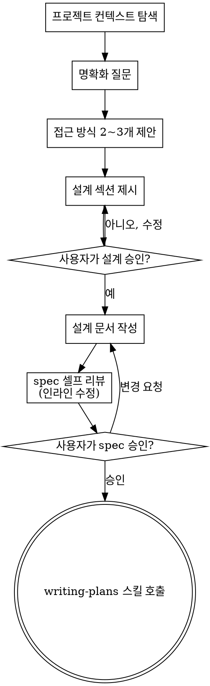

# 아이디어를 설계로 다듬는 브레인스토밍

자연스러운 협업 대화를 통해 아이디어를 완성된 설계와 spec으로 다듬는다.

먼저 현재 프로젝트 컨텍스트를 파악한 뒤, 한 번에 하나씩 질문하며 아이디어를 구체화한다. 무엇을 만들지 이해했다면 설계를 제시하고 사용자 승인을 받는다.

<HARD-GATE>
설계를 제시하고 사용자가 승인하기 전까지는 어떤 구현 스킬도 호출하지 말고, 코드를 작성하거나 프로젝트를 스캐폴딩하거나 구현 행동을 일절 하지 않는다. 아무리 단순해 보이는 프로젝트라도 예외 없이 적용된다.
</HARD-GATE>

## 안티패턴: "이건 너무 단순해서 설계가 필요 없다"

모든 프로젝트가 이 과정을 거친다. 투두 리스트든, 함수 하나짜리 유틸리티든, 설정 변경이든 전부 마찬가지다. 검증되지 않은 가정이 가장 큰 낭비를 만드는 곳이 바로 "단순한" 프로젝트다. 설계는 짧아도 된다(정말 단순한 프로젝트라면 몇 문장이면 충분). 하지만 반드시 제시하고 승인을 받아야 한다.

## 체크리스트

아래 항목 각각을 태스크로 만들고 순서대로 완료해야 한다:

1. **프로젝트 컨텍스트 탐색** — 파일, 문서, 최근 commit 확인
2. **비주얼 컴패니언은 필요한 순간에 제안** — 미리 제안하지 않는다. 말로 설명하는 것보다 보여주는 게 확실히 나은 질문이 처음 나올 때, 그때 (별도 메시지로) 제안한다. 승인하면 브라우저 탭이 자동으로 열린다. 시각적 질문이 끝내 나오지 않으면 제안하지 않는다. 아래 비주얼 컴패니언 섹션 참고.
3. **명확화 질문** — 한 번에 하나씩, 목적·제약·성공 기준을 파악
4. **접근 방식 2~3개 제안** — 트레이드오프와 함께 추천안을 제시
5. **설계 제시** — 복잡도에 맞게 섹션을 나누고, 각 섹션마다 사용자 승인을 받음
6. **설계 문서 작성** — `docs/superpowers/specs/YYYY-MM-DD-<topic>-design.md`에 저장하고 commit
7. **spec 셀프 리뷰** — 플레이스홀더, 모순, 모호함, 범위를 인라인으로 빠르게 점검 (아래 참고)
8. **사용자의 spec 리뷰** — 다음 단계로 가기 전 사용자에게 spec 파일 리뷰를 요청
9. **구현으로 전환** — writing-plans 스킬을 호출해 구현 plan 작성

## 프로세스 흐름

**최종 상태는 writing-plans 호출이다.** frontend-design, mcp-builder 등 다른 구현 스킬은 호출하지 않는다. 브레인스토밍 이후 호출하는 유일한 스킬은 writing-plans다.

## 진행 방법

**아이디어 이해하기:**

- 먼저 현재 프로젝트 상태를 확인한다 (파일, 문서, 최근 commit)
- 세부 질문에 들어가기 전에 범위부터 가늠한다. 요청이 여러 독립 서브시스템을 담고 있다면 (예: "채팅, 파일 저장, 결제, 분석이 있는 플랫폼을 만들어줘") 즉시 이를 짚어준다. 분해가 먼저 필요한 프로젝트의 세부사항을 다듬느라 질문을 낭비하지 않는다.
- 프로젝트가 단일 spec에 담기에 너무 크면, 사용자와 함께 서브 프로젝트로 분해한다: 독립적인 조각은 무엇인지, 서로 어떻게 연결되는지, 어떤 순서로 만들어야 하는지. 그다음 첫 번째 서브 프로젝트를 일반 설계 흐름대로 브레인스토밍한다. 각 서브 프로젝트는 자체 spec → plan → 구현 사이클을 가진다.
- 적절한 범위의 프로젝트라면 한 번에 하나씩 질문하며 아이디어를 구체화한다
- 가능하면 객관식 질문을 선호하되, 주관식도 괜찮다
- 메시지당 질문은 하나만 — 한 주제를 더 파야 한다면 여러 질문으로 나눈다
- 이해에 집중한다: 목적, 제약, 성공 기준

**접근 방식 탐색하기:**

- 트레이드오프와 함께 서로 다른 접근 방식 2~3개를 제안한다
- 추천안과 그 이유를 곁들여 대화하듯 옵션을 제시한다
- 추천하는 옵션을 앞세우고 이유를 설명한다

**설계 제시하기:**

- 무엇을 만들지 이해했다고 판단되면 설계를 제시한다
- 각 섹션은 복잡도에 맞게 조절한다: 단순하면 몇 문장, 미묘한 부분이 있으면 200~300단어까지
- 섹션마다 여기까지 맞는지 물어본다
- 다룰 내용: 아키텍처, 컴포넌트, 데이터 흐름, 에러 처리, 테스트
- 말이 안 되는 부분이 있으면 언제든 되돌아가 명확히 한다

**격리와 명료함을 위한 설계:**

- 시스템을 작은 단위로 나눈다. 각 단위는 하나의 명확한 목적을 갖고, 잘 정의된 인터페이스로 소통하며, 독립적으로 이해하고 테스트할 수 있어야 한다
- 각 단위에 대해 답할 수 있어야 한다: 무엇을 하는가, 어떻게 쓰는가, 무엇에 의존하는가
- 내부를 읽지 않고도 그 단위가 뭘 하는지 알 수 있는가? 소비자를 깨뜨리지 않고 내부를 바꿀 수 있는가? 아니라면 경계를 다시 손봐야 한다
- 작고 경계가 분명한 단위는 에이전트 입장에서도 다루기 쉽다 — 컨텍스트에 한 번에 담을 수 있는 코드일수록 추론이 정확해지고, 파일이 집중되어 있을수록 편집이 안정적이다. 파일이 비대해졌다면 대개 너무 많은 일을 하고 있다는 신호다

**기존 코드베이스에서 작업할 때:**

- 변경을 제안하기 전에 현재 구조를 먼저 탐색한다. 기존 패턴을 따른다.
- 기존 코드의 문제가 이번 작업에 영향을 준다면 (예: 너무 커진 파일, 불분명한 경계, 얽힌 책임), 좋은 개발자가 자기가 손대는 코드를 개선하듯 표적 개선을 설계에 포함한다.
- 무관한 리팩토링은 제안하지 않는다. 현재 목표에 기여하는 것에만 집중한다.

## 설계 이후

**문서화:**

- 검증된 설계(spec)를 `docs/superpowers/specs/YYYY-MM-DD-<topic>-design.md`에 작성한다
  - (spec 위치에 대한 사용자 선호가 있으면 이 기본값보다 우선한다)
- elements-of-style:writing-clearly-and-concisely 스킬이 있으면 활용한다
- 설계 문서를 git에 commit한다

**spec 셀프 리뷰:**
spec 문서를 쓴 뒤 새로운 눈으로 다시 본다:

1. **플레이스홀더 스캔:** "TBD", "TODO", 미완성 섹션, 모호한 요구사항이 있는가? 고친다.
2. **내부 일관성:** 서로 모순되는 섹션이 있는가? 아키텍처가 기능 설명과 맞는가?
3. **범위 점검:** 단일 구현 plan에 담을 만큼 집중되어 있는가, 아니면 분해가 필요한가?
4. **모호함 점검:** 두 가지로 해석될 수 있는 요구사항이 있는가? 있다면 하나를 골라 명시한다.

문제는 인라인으로 바로 고친다. 재리뷰는 불필요 — 고치고 넘어간다.

**사용자 리뷰 게이트:**
spec 리뷰 루프를 통과하면, 다음으로 가기 전에 사용자에게 작성된 spec 리뷰를 요청한다:

> "spec을 `<경로>`에 작성하고 commit했습니다. 구현 plan 작성에 들어가기 전에 리뷰해 보시고 수정할 부분이 있으면 알려주세요."

사용자 응답을 기다린다. 변경 요청이 오면 반영하고 spec 리뷰 루프를 다시 돈다. 사용자가 승인한 뒤에만 진행한다.

**구현:**

- writing-plans 스킬을 호출해 상세 구현 plan을 작성한다
- 다른 스킬은 호출하지 않는다. writing-plans가 다음 단계다.

## 핵심 원칙

- **한 번에 하나의 질문** — 여러 질문으로 부담을 주지 않는다
- **객관식 선호** — 가능하면 주관식보다 답하기 쉽다
- **가차 없는 YAGNI** — 불필요한 기능은 모든 설계에서 제거한다
- **대안 탐색** — 결정하기 전에 항상 2~3개 접근 방식을 제안한다
- **점진적 검증** — 설계를 제시하고 승인을 받은 뒤 다음으로 넘어간다
- **유연하게** — 말이 안 되는 부분이 있으면 되돌아가 명확히 한다

## 비주얼 컴패니언

브레인스토밍 중 목업, 다이어그램, 시각적 옵션을 보여주기 위한 브라우저 기반 컴패니언이다. 도구이지 모드가 아니다. 컴패니언을 수락했다는 것은 시각적 표현이 도움이 되는 질문에 쓸 수 있게 되었다는 뜻이지, 모든 질문이 브라우저를 거친다는 뜻이 아니다.

**컴패니언 제안 (필요한 순간에):** 미리 제안하지 않는다. 말로 설명하는 것보다 보여주는 게 확실히 나은 질문 — 단순히 UI가 *주제*인 게 아니라 실제 목업/레이아웃/다이어그램 질문 — 이 나올 때까지 기다린다. 그런 질문이 처음 나올 때, 별도 메시지로 제안한다:
> "다음 부분은 직접 보여드리는 게 나을 것 같아요 — 진행하면서 목업, 다이어그램, 비교안을 브라우저 탭에 띄워드릴 수 있습니다. 아직 새로운 기능이고 토큰을 많이 쓸 수 있어요. 해볼까요? 브라우저는 제가 열어드립니다."

**이 제안은 반드시 단독 메시지여야 한다.** 제안만 — 명확화 질문, 요약, 다른 내용을 섞지 않는다. 사용자 응답을 기다린다. 수락하면 `--open`으로 서버를 시작해 첫 화면이 브라우저에 자동으로 열리게 한다. 거절하면 텍스트로만 진행하고, 사용자가 먼저 언급하지 않는 한 다시 제안하지 않는다.

**질문 단위 판단:** 사용자가 수락한 뒤에도, 브라우저를 쓸지 터미널을 쓸지 질문마다 판단한다. 기준: **읽는 것보다 보는 것이 이해에 더 나은가?**

- **브라우저 사용** — 내용 자체가 시각적인 것: 목업, 와이어프레임, 레이아웃 비교, 아키텍처 다이어그램, 시각 디자인 나란히 비교
- **터미널 사용** — 내용이 텍스트인 것: 요구사항 질문, 개념적 선택, 트레이드오프 목록, A/B/C/D 텍스트 옵션, 범위 결정

UI 주제에 관한 질문이라고 자동으로 시각적 질문이 되는 건 아니다. "이 맥락에서 개성이란 무슨 뜻인가요?"는 개념적 질문 — 터미널을 쓴다. "어떤 위저드 레이아웃이 더 나은가요?"는 시각적 질문 — 브라우저를 쓴다.

사용자가 컴패니언에 동의하면, 진행하기 전에 상세 가이드를 읽는다:
`skills/brainstorming/visual-companion.md`
