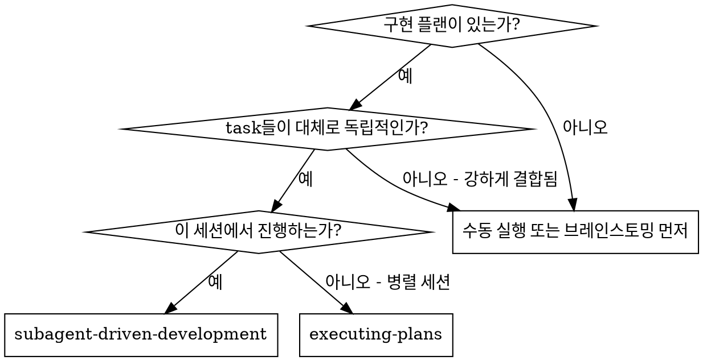
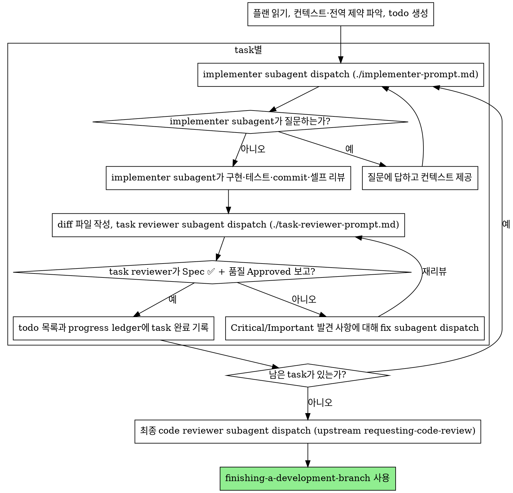

# Subagent-Driven Development

플랜의 task마다 새 implementer subagent를 dispatch하고, 각 task 후에 task 리뷰(스펙 준수 + 코드 품질)를, 마지막에 브랜치 전체를 보는 최종 리뷰를 수행한다.

**왜 subagent인가:** task를 격리된 컨텍스트를 가진 전담 에이전트에게 위임한다. 지시와 컨텍스트를 정밀하게 구성해 주면 subagent는 자기 task에만 집중해 성공할 수 있다. subagent는 이 세션의 컨텍스트나 히스토리를 절대 물려받지 않는다 — 필요한 것을 정확히 골라 직접 구성해서 넘긴다. 이렇게 하면 조율 작업을 위한 내 컨텍스트도 보존된다.

**핵심 원칙:** task마다 새 subagent + task 리뷰(스펙 + 품질) + 최종 전체 리뷰 = 높은 품질, 빠른 반복

**진행 서술:** 툴 호출 사이의 서술은 짧은 한 줄 이내로 한다 — 기록은 ledger와 툴 결과가 담당한다.

**연속 실행:** task 사이마다 멈춰서 사람에게 확인받지 않는다. 플랜의 모든 task를 중단 없이 실행한다. 멈춰야 하는 경우는 딱 세 가지다: 스스로 해결할 수 없는 BLOCKED 상태, 진행을 실제로 막는 모호함, 모든 task 완료. "계속할까요?" 같은 질문과 중간 진행 요약은 상대의 시간 낭비다 — 플랜 실행을 요청받았으면 실행한다.

## 언제 사용하나



**Executing Plans(병렬 세션) 대비:**
- 같은 세션에서 진행 (컨텍스트 전환 없음)
- task마다 새 subagent (컨텍스트 오염 없음)
- task마다 리뷰(스펙 준수 + 코드 품질), 마지막에 전체 리뷰
- 더 빠른 반복 (task 사이에 사람 개입 없음)

## 프로세스



## 실행 전 플랜 점검

Task 1을 dispatch하기 전에 플랜을 한 번 훑어 충돌을 찾는다:

- task끼리, 또는 플랜의 전역 제약(Global Constraints)과 모순되는 부분
- 플랜이 명시적으로 요구하지만 리뷰 기준상 결함인 것 (아무것도 assert하지
  않는 테스트, 로직 블록의 그대로 복붙 등)

발견한 것은 실행 시작 전에 한 번에 묶어 사람에게 질문한다 — 각 발견 사항을
그것을 요구하는 플랜 원문과 나란히 놓고 어느 쪽을 따를지 묻는다. 플랜 중간에
발견할 때마다 하나씩 끊어 묻지 않는다. 점검 결과가 깨끗하면 언급 없이
진행한다. 구현 과정에서만 드러나는 충돌은 리뷰 루프가 잡는다.

## 모델 선택

**역할 기반 2-tier 정책.** 실행 역할은 Opus로 고정하고, 판단 역할만 세션
모델을 상속받는다. 목적은 Fable(희소·고비용 플래그십)을 판단에만 집중시키고
대량의 구현·수정 작업은 Opus 워크호스로 흘려보내는 것이다.

- **실행 tier — `model: opus` 고정:** implementer, fixer. 세션이 Fable이어도
  Opus로 내려 토큰 폭증을 막는다. Opus는 제약 없이 쓰는 워크호스다.
- **판단 tier — model 미지정(세션 모델 상속):** task reviewer, 최종 code
  reviewer. 세션이 Fable이면 Fable로 고품질 판단을 받고, 세션이 Opus면 Opus로
  저렴하게 돈다. 판단 품질이 결과를 좌우하는 역할만 여기 들어간다.

즉 평소 Opus 세션에서는 모든 역할이 Opus로 저렴하게 돌고, 중요한 리뷰를
Fable로 받고 싶을 때만 세션을 Fable로 전환하면 리뷰어만 Fable이 되고
implementer·fixer는 Opus로 유지된다.

- task의 난이도나 diff의 크기에 따라 tier를 바꾸지 않는다 — 역할이 tier를
  결정한다.
- BLOCKED 처리에서도 실행 tier의 모델을 올리는 선택지는 없다 — 컨텍스트를
  보강해 재-dispatch하는 것이 대응 수단이다.

## Implementer 상태 처리

implementer subagent는 네 가지 상태 중 하나를 보고한다. 각각 이렇게 처리한다:

**DONE:** 리뷰 패키지를 생성하고(`scripts/review-package PLAN_FILE BASE HEAD`, 이 스킬
디렉토리에서 실행 — 작성한 고유 파일 경로를 출력한다; BASE는 implementer를
dispatch하기 전에 기록해 둔 commit이다 — 절대 `HEAD~1`을 쓰지 말 것,
multi-commit task에서 마지막 commit만 남기고 조용히 잘라먹는다), 출력된
경로를 넘겨 task reviewer를 dispatch한다.

**DONE_WITH_CONCERNS:** implementer가 작업은 완료했지만 우려를 남겼다.
진행하기 전에 우려 내용을 읽는다. 정확성이나 범위에 관한 우려면 리뷰 전에
해결한다. 관찰성 코멘트(예: "이 파일이 커지고 있다")면 기록해 두고 리뷰로
진행한다.

**NEEDS_CONTEXT:** implementer에게 제공되지 않은 정보가 필요하다. 빠진
컨텍스트를 제공하고 재-dispatch한다.

**BLOCKED:** implementer가 task를 완료할 수 없다. 원인을 판단한다:
1. 컨텍스트 문제라면, 컨텍스트를 더 제공하고 재-dispatch한다
2. task에 더 깊은 추론이 필요하다면, 컨텍스트를 보강해(관련 파일, 인터페이스,
   접근 방향, 예시) 재-dispatch한다
3. task가 너무 크다면, 더 작은 조각으로 쪼갠다
4. 플랜 자체가 잘못됐다면, 사람에게 에스컬레이션한다

에스컬레이션을 **절대** 무시하지 말고, 아무 변경 없이 그대로 재시도시키지
마라. implementer가 막혔다고 말했다면 무언가는 바뀌어야 한다.

## Reviewer의 ⚠️ 항목 처리

task reviewer가 "⚠️ diff만으로는 검증 불가" 항목을 보고할 수 있다 — 변경되지
않은 코드에 있거나 여러 task에 걸친 요구사항이다. 이 항목이 나머지 리뷰를
막지는 않지만, task를 완료로 표시하기 전에 각 항목을 직접 해소해야 한다:
reviewer에게 없는 플랜과 task 간 컨텍스트를 쥔 것은 나다. 실제 누락으로
확인되면 스펙 리뷰 실패로 취급한다 — implementer에게 돌려보내고 재리뷰한다.

## Reviewer 프롬프트 구성

task별 리뷰는 task 범위의 게이트다. 넓은 리뷰는 마지막의 브랜치 전체 리뷰에서
한 번 한다. reviewer 템플릿을 채울 때:

- 구체적이고 task에 특정된 이유 없이 "모든 사용처를 확인하라", "필요하면
  race 테스트를 돌려라" 같은 열린 지시를 덧붙이지 않는다
- implementer가 같은 코드에 대해 이미 돌린 테스트를 reviewer에게 다시
  돌리라고 하지 않는다 — 테스트 증거는 implementer의 보고가 담당한다
- reviewer 대신 발견 사항을 미리 재단하지 않는다 — 특정 이슈를 무시하라거나
  지적하지 말라고 지시하지 마라. 어떤 발견이 false positive라고 생각되면,
  reviewer가 제기하게 두고 리뷰 루프에서 판정한다. 작성 중인 프롬프트에
  "지적하지 마라", "X는 결함으로 보지 마라", "최대 Minor로", "플랜이 그렇게
  정했다"가 들어 있다면 — 멈춰라: 리뷰 루프 한 번을 아끼려고 미리 재단하고
  있는 것이다.
- reviewer에게 넘기는 전역 제약 블록은 reviewer의 주의를 조준하는 렌즈다.
  플랜의 Global Constraints 섹션이나 스펙에서 구속력 있는 요구사항을 원문
  그대로 복사한다: 정확한 값, 정확한 포맷, 컴포넌트 간 명시된 관계("X와 같은
  레이아웃", "Y와 일치"). 프로세스 규칙(YAGNI, 테스트 위생, 리뷰 방법)은
  reviewer 템플릿에 이미 있다 — 제약 블록은 이 프로젝트의 스펙이 요구하는
  것을 담는 자리다.
- reviewer에게 diff는 파일로 넘긴다: 이 스킬의
  `scripts/review-package PLAN_FILE BASE HEAD`를 실행하고 출력된 파일 경로를 전달한다
  (bash 없이는: `git log --oneline`, `git diff --stat`, 범위에 대한
  `git diff -U10`을 고유한 이름의 파일 하나로 리다이렉트). 출력물이 내
  컨텍스트에 들어오지 않고, reviewer는 Read 한 번으로 commit 목록, stat
  요약, 컨텍스트가 포함된 전체 diff를 본다. BASE는 implementer를 dispatch하기
  전에 기록한 것을 쓴다 — `HEAD~1`은 multi-commit task를 조용히 잘라먹으니
  절대 쓰지 않는다.
- dispatch 프롬프트는 하나의 task를 설명하는 것이지 세션의 역사를 담는 것이
  아니다. 이전 task들의 누적 요약("Task 1-3 이후의 상태")을 뒤의 dispatch에
  붙여 넣지 마라 — 실제 세션에서 42k자짜리 dispatch가 나왔는데 99%가 붙여
  넣은 과거 기록이었다. 새 subagent에게 필요한 것은 자기 task, 자신이 만지는
  인터페이스, 전역 제약뿐이다. 그 이상은 없다.
- Critical과 Important 발견 사항에는 fix subagent를 dispatch한다. Minor는
  진행하면서 progress ledger에 기록해 두고, 최종 브랜치 전체 리뷰가 그
  목록을 보고 merge 전에 고칠 것을 선별하게 한다. 아무도 읽지 않는 롤업은
  조용한 폐기다.
- plan-mandated 라벨이 붙은 발견 사항 — 또는 플랜 원문이 요구하는 것과
  충돌하는 모든 발견 사항 — 은 여느 플랜 모순과 마찬가지로 사람이 결정할
  일이다: 발견 사항과 플랜 원문을 나란히 제시하고 어느 쪽을 따를지 묻는다.
  플랜이 요구한다는 이유로 발견을 기각하지 말고, 묻지도 않고 플랜과 모순되는
  수정을 dispatch하지도 마라.
- 최종 브랜치 전체 리뷰에도 패키지를 준다:
  `scripts/review-package PLAN_FILE MERGE_BASE HEAD`를 실행하고(MERGE_BASE = 브랜치가
  시작된 commit, 예: `git merge-base main HEAD`) 출력된 경로를 최종 리뷰
  dispatch에 포함한다. 최종 reviewer가 git 명령으로 브랜치 diff를 다시
  구하는 대신 파일 하나만 읽게 한다.
- 모든 fix dispatch에는 implementer 계약이 따라간다: fix subagent는 자기
  변경을 커버하는 테스트를 재실행하고 결과를 보고한다. dispatch에 커버하는
  테스트 파일명을 명시한다 — 한 줄짜리 수정에 전체 스위트는 필요 없다.
  reviewer를 재-dispatch하기 전에 fix 보고에 커버 테스트, 실행한 명령, 출력
  세 가지가 모두 있는지 확인하고, 셋이 갖춰졌을 때 재리뷰를 dispatch한다.
- 최종 브랜치 전체 리뷰가 발견 사항을 돌려주면, 전체 발견 목록을 담아 fix
  subagent를 **하나만** dispatch한다 — 발견당 하나씩이 아니다. 발견별
  fixer는 각자 컨텍스트를 다시 쌓고 스위트를 다시 돌린다; 실제 세션에서 최종
  리뷰 수정 웨이브가 모든 task를 합친 것보다 비쌌던 적이 있다.

## 파일 핸드오프

dispatch 프롬프트에 붙여 넣은 모든 것 — 그리고 subagent가 돌려준 모든 출력 —
은 세션 끝까지 내 컨텍스트에 상주하며 이후 모든 턴에서 다시 읽힌다. 산출물은
파일로 넘긴다:

- **Task brief:** implementer를 dispatch하기 전에 이 스킬의
  `scripts/task-brief PLAN_FILE N`을 실행한다 — task의 전체 텍스트를 고유한
  이름의 파일로 추출하고 경로를 출력한다. brief가 요구사항의 단일 출처로
  남도록 dispatch를 구성한다. dispatch에는 다음이 들어간다: (1) 이 task가
  프로젝트 어디에 위치하는지 한 줄; (2) brief 경로 — "이것을 먼저 읽어라,
  이것이 네 요구사항이며 사용할 정확한 값이 그대로 담겨 있다"라고 소개;
  (3) brief가 알 수 없는, 앞선 task들에서 나온 인터페이스와 결정; (4) brief에서
  발견한 모호함에 대한 나의 해석; (5) 보고 파일 경로와 보고 계약. 정확한
  값(숫자, 매직 스트링, 시그니처, 테스트 케이스)은 brief에만 존재한다.
- **보고 파일:** implementer의 보고 파일은 brief 이름을 따라 짓고(brief
  `…/task-N-brief.md` → 보고 `…/task-N-report.md`) dispatch 프롬프트에
  넣는다. implementer는 전체 보고를 거기에 쓰고 상태, commit 목록, 한 줄
  테스트 요약, 우려 사항만 돌려준다.
- **Reviewer 입력:** task reviewer는 세 개의 경로를 받는다 — 같은 brief
  파일, 보고 파일, 리뷰 패키지 — 여기에 task를 구속하는 전역 제약을 더한다.
- fix dispatch는 fix 보고(테스트 결과 포함)를 같은 보고 파일에 덧붙이고 짧은
  요약을 돌려준다; 재리뷰는 갱신된 파일을 읽는다.

## 내구성 있는 진행 기록

대화 메모리는 컴팩션을 견디지 못한다. 실제 세션들에서, 위치를 잃은
controller가 이미 완료한 task 시퀀스 전체를 재-dispatch한 적이 있다 — 관측된
것 중 가장 비싼 실패다. 진행 상황은 todo에만 두지 말고 ledger 파일에
기록한다.

- 스킬 시작 시 `scripts/sdd-workspace PLAN_FILE`을 실행해 이 plan 전용 작업
  디렉토리를 구한다. 그 안의 `progress.md`가 이 plan의 ledger다.
- 이 plan의 ledger에 완료로 기록된 task는 DONE이다 — 재-dispatch하지 말고,
  완료 표시가 없는 첫 task부터 재개한다. 다른 plan의 workspace나 예전의 평면
  경로 `.superpowers/sdd/progress.md`는 현재 진행 상황으로 해석하지 않는다.
- task의 리뷰가 깨끗하게 돌아오면, 다른 정리 작업과 같은 메시지에서 ledger에
  한 줄을 덧붙인다:
  `Task N: complete (commits <base7>..<head7>, review clean)`.
- ledger는 복구 지도다: 거기에 적힌 commit들은 내 컨텍스트가 만든 기억을
  잃어도 git에 존재한다. 컴팩션 후에는 내 기억보다 ledger와 `git log`를
  믿어라.
- `git clean -fdx`는 ledger를 지운다(git-ignored 스크래치이므로); 그런 일이
  생기면 `git log`로 복구한다.

## 프롬프트 템플릿

- [implementer-prompt.md](implementer-prompt.md) - implementer subagent dispatch
- [task-reviewer-prompt.md](task-reviewer-prompt.md) - task reviewer subagent dispatch (스펙 준수 + 코드 품질)
- 최종 브랜치 전체 리뷰: upstream requesting-code-review의 [code-reviewer.md](https://github.com/obra/superpowers/blob/44c9b2d6e889982ac18c27d05a19fefe335194e1/skills/requesting-code-review/code-reviewer.md) 사용

## 예시 워크플로

```
나: Subagent-Driven Development로 이 플랜을 실행한다.

[플랜 파일을 한 번 읽음: docs/superpowers/plans/feature-plan.md]
[모든 task에 대한 todo 생성]

Task 1: Hook 설치 스크립트

[Task 1에 대해 task-brief 실행; brief + 보고 경로 + 컨텍스트로 implementer dispatch]

Implementer: "시작하기 전에 — hook은 유저 레벨과 시스템 레벨 중 어디에 설치하나요?"

나: "유저 레벨 (~/.config/superpowers/hooks/)"

Implementer: "알겠습니다. 구현합니다..."
[잠시 후] Implementer:
  - install-hook 명령 구현
  - 테스트 추가, 5/5 통과
  - 셀프 리뷰: --force 플래그 누락 발견, 추가함
  - commit 완료

[review-package 실행, 출력된 경로로 task reviewer dispatch]
Task reviewer: Spec ✅ - 모든 요구사항 충족, 초과 구현 없음.
  강점: 테스트 커버리지 좋음, 깔끔함. 이슈: 없음. Task quality: Approved.

[Task 1 완료 표시]

Task 2: 복구 모드

[Task 2에 대해 task-brief 실행; brief + 보고 경로 + 컨텍스트로 implementer dispatch]

Implementer: [질문 없이 진행]
Implementer:
  - verify/repair 모드 추가
  - 테스트 8/8 통과
  - 셀프 리뷰: 문제 없음
  - commit 완료

[review-package 실행, 출력된 경로로 task reviewer dispatch]
Task reviewer: Spec ❌:
  - 누락: 진행률 보고 (스펙: "100건마다 보고")
  - 초과: --json 플래그 추가됨 (요청되지 않음)
  이슈 (Important): 매직 넘버 (100)

[전체 발견 사항을 담아 fix subagent dispatch]
Fixer: --json 플래그 제거, 진행률 보고 추가, PROGRESS_INTERVAL 상수 추출

[task reviewer가 다시 리뷰]
Task reviewer: Spec ✅. Task quality: Approved.

[Task 2 완료 표시]

...

[모든 task 완료 후]
[최종 code-reviewer dispatch]
최종 reviewer: 모든 요구사항 충족, merge 준비 완료

완료!
```

## 장점

**수동 실행 대비:**
- subagent는 자연스럽게 TDD를 따른다
- task마다 새 컨텍스트 (혼선 없음)
- 병렬 안전 (subagent끼리 간섭하지 않음)
- subagent가 질문할 수 있음 (작업 전에도, 도중에도)

**Executing Plans 대비:**
- 같은 세션 (핸드오프 없음)
- 연속 진행 (대기 없음)
- 리뷰 체크포인트 자동

**효율:**
- controller가 필요한 컨텍스트만 정확히 선별; 부피 큰 산출물은 붙여 넣기가
  아니라 파일로 이동
- subagent는 완전한 정보를 처음부터 받음
- 질문이 작업 시작 전에 표면화됨 (끝난 뒤가 아니라)

**품질 게이트:**
- 셀프 리뷰가 핸드오프 전에 이슈를 잡음
- task 리뷰는 두 개의 판정을 담음: 스펙 준수와 코드 품질
- 리뷰 루프와 implementer의 테스트 증거가 수정 실패 가능성을 낮춤
- 스펙 준수 검증이 과잉/과소 구현을 방지
- 코드 품질 검증이 구현의 완성도를 한 번 더 점검

**비용:**
- subagent 호출이 더 많음 (task당 implementer + reviewer)
- controller의 준비 작업이 더 많음 (task를 미리 모두 추출)
- 리뷰 루프가 반복을 추가
- 그러나 이슈를 일찍 잡는다 (나중에 디버깅하는 것보다 싸다)

## 금지 사항

**절대 하지 마라:**
- 사용자의 명시적 동의 없이 main/master 브랜치에서 구현 시작
- task 리뷰 생략, 또는 두 판정 중 하나라도 빠진 보고 수용 (스펙 준수와 task
  품질 둘 다 필수)
- 미해결 이슈를 둔 채 진행
- 구현 subagent 여러 개를 병렬로 dispatch (충돌)
- subagent에게 플랜 파일 전체를 읽게 함 (`scripts/task-brief`로 task brief를
  뽑아 넘길 것)
- 배경 설명 컨텍스트 생략 (subagent는 task가 어디에 위치하는지 이해해야 함)
- subagent의 질문 무시 (진행시키기 전에 답할 것)
- 스펙 준수에서 "이 정도면 됐다" 수용 (reviewer가 스펙 이슈를 찾았다 = 완료
  아님)
- 리뷰 루프 생략 (reviewer가 이슈를 찾았다 = implementer가 고친다 = 다시
  리뷰한다)
- implementer의 셀프 리뷰로 실제 리뷰를 대체 (둘 다 필요)
- reviewer에게 무엇을 지적하지 말라고 하거나, dispatch 프롬프트에서 발견의
  심각도를 미리 매김("최대 Minor로 취급") — 플랜의 예시 코드는 출발점이지 그
  약점이 의도된 선택이었다는 증거가 아니다
- diff 파일 없이 task reviewer를 dispatch — 먼저 생성하고
  (`scripts/review-package PLAN_FILE BASE HEAD`) 출력된 경로를 프롬프트에 명시할 것
- 리뷰에 미해결 Critical/Important 이슈가 열려 있는데 다음 task로 이동
- progress ledger가 이미 완료로 기록한 task를 재-dispatch — 컴팩션이나 재개
  후에는 ledger(그리고 `git log`)를 확인할 것

**subagent가 질문하면:**
- 명확하고 완전하게 답한다
- 필요하면 추가 컨텍스트를 제공한다
- 구현을 서두르게 하지 않는다

**reviewer가 이슈를 찾으면:**
- implementer(같은 subagent)가 고친다
- reviewer가 다시 리뷰한다
- Approved까지 반복한다
- 재리뷰를 건너뛰지 않는다

**subagent가 task에 실패하면:**
- 구체적인 지시를 담아 fix subagent를 dispatch한다
- 직접 고치려 하지 않는다 (컨텍스트 오염)

## 연계

**작업 공간:** 현재 워크스페이스에서 새 브랜치를 만들어 작업한다 (worktree
사용 안 함, main 직접 작업 금지).

**필수 워크플로 스킬:**
- **writing-plans** - 이 스킬이 실행할 플랜을 작성
- **requesting-code-review** - 최종 브랜치 전체 리뷰의 코드 리뷰 템플릿
- **finishing-a-development-branch** - 모든 task 완료 후 개발 마무리

**subagent가 사용할 스킬:**
- **test-driven-development** - subagent는 각 task에서 TDD를 따름

**대안 워크플로:**
- **superpowers:executing-plans** - 같은 세션 대신 병렬 세션으로 실행할 때
